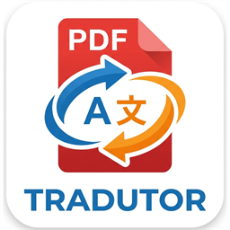
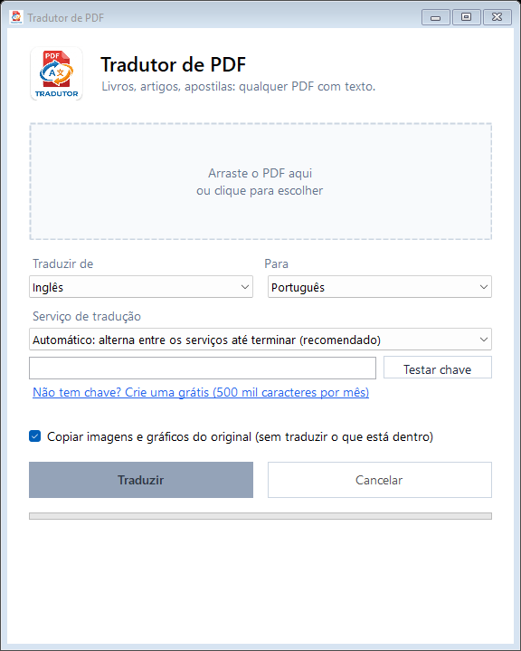

<p align="center">
  
</p>

<h1 align="center">Tradutor de PDF</h1>

<p align="center">
  Traduza livros, artigos e apostilas em PDF e receba o resultado em PDF.<br>
  Grátis, sem cadastro, para Windows.
</p>

<p align="center">
  
</p>

---

## O que ele faz

- **Traduz PDFs inteiros**, inclusive livros com centenas de páginas.
- **Gera um PDF novo** com o texto traduzido, formatado em A4 e com números de página.
- **Mantém imagens, gráficos e diagramas**: eles são copiados do original como imagem, no lugar certo, sem tentar traduzir o que está dentro.
- **Não para no meio**: quando um serviço de tradução bloqueia por excesso de uso, o app passa automaticamente para outro e continua até o fim.
- **Continua de onde parou**: se você fechar o app, cancelar ou a internet cair, o que já foi traduzido fica salvo. É só clicar em Traduzir de novo.
- **PDF parcial**: se não quiser esperar, gere um PDF com as páginas já traduzidas. As que faltam ficam no idioma original, marcadas.
- **14 idiomas**: português, inglês, espanhol, francês, alemão, italiano, holandês, polonês, russo, turco, árabe, japonês, coreano e chinês. O idioma original é detectado automaticamente.

## Serviços de tradução

| Serviço | Precisa de cadastro? | Observação |
|---|---|---|
| **Google Tradutor** | Não | Grátis. Bloqueia temporariamente se usado demais. |
| **Microsoft Tradutor** | Não | Grátis. O limite é separado do Google. |
| **DeepL** | Sim (chave grátis) | Melhor qualidade. 500 mil caracteres por mês no plano gratuito. |

No modo **Automático** (recomendado), o app usa o DeepL primeiro (se você colocar uma chave), depois o Google e depois a Microsoft. Quando um bloqueia, ele troca para o próximo. Se todos estiverem bloqueados, espera o primeiro liberar e continua sozinho.

## Como instalar e usar

### Requisitos

- Windows 10 ou 11
- [.NET 8 SDK](https://dotnet.microsoft.com/download/dotnet/8.0)

### Passo a passo

1. Baixe o projeto: clique em **Code → Download ZIP** e extraia, ou use:
   ```
   git clone https://github.com/Wendel4444/Tradutor-de-PDF.git
   ```
2. Abra um terminal dentro da pasta do projeto e rode:
   ```
   dotnet run
   ```
3. Na janela que abrir:
   1. Arraste o PDF para a área tracejada (ou clique nela para escolher o arquivo).
   2. Escolha o idioma de origem e o de destino.
   3. Deixe o serviço em **Automático**.
   4. Clique em **Traduzir**.

O PDF traduzido é salvo na mesma pasta do original, com o nome `nome-do-arquivo (pt).pdf`.

### Usando o DeepL (opcional)

1. Crie uma conta gratuita em [deepl.com/pro-api](https://www.deepl.com/pro-api) (pede cartão para verificação, mas o plano Free não cobra).
2. Copie sua chave de API (a gratuita termina em `:fx`).
3. No app, cole a chave no campo do DeepL e clique em **Testar chave**.

A chave fica salva apenas no seu computador, criptografada pelo Windows, em `%APPDATA%\TradutorPdf\config.json`. Ela nunca é enviada para outro lugar além do próprio DeepL.

## Limitações

- **PDFs escaneados** (páginas que são fotos) não funcionam, porque não têm texto para extrair. Seria preciso OCR.
- **A diagramação original não é mantida**: o texto é remontado num layout limpo em A4. Colunas, fontes e cores do original se perdem, mas imagens e gráficos são preservados.
- **Legendas e textos dentro de gráficos** ficam no idioma original, porque fazem parte da imagem copiada.
- **Números de página e cabeçalhos** do PDF original às vezes aparecem no meio do texto.
- **Tabelas** desenhadas só com linhas são traduzidas como texto corrido.

## Avisos

- Os modos gratuitos do **Google** e da **Microsoft** usam endereços públicos que esses serviços usam no navegador. Eles não são APIs oficiais, podem mudar a qualquer momento e têm limites de uso. Use com moderação.
- **Direitos autorais**: traduzir um livro para uso pessoal é diferente de distribuir a tradução. A responsabilidade pelo uso do conteúdo traduzido é de quem usa o app.

## Tecnologias

| Biblioteca | Uso | Licença |
|---|---|---|
| [PdfPig](https://github.com/UglyToad/PdfPig) | Leitura do texto e do layout do PDF | Apache 2.0 |
| [QuestPDF](https://www.questpdf.com) | Geração do PDF traduzido | [Community](https://www.questpdf.com/license/) (grátis para pessoas, projetos open source e empresas com faturamento anual abaixo de US$ 1 milhão) |
| [PDFtoImage](https://github.com/sungaila/PDFtoImage) | Recorte de imagens e gráficos do PDF original (usa o PDFium) | MIT |
| WinForms (.NET 8) | Interface | MIT |
